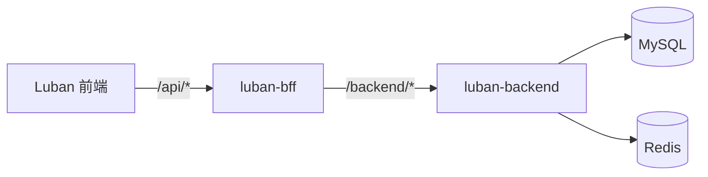

# Luban 后端 API（权威文档）

本文档为鲁班低代码平台后端接口的**权威定义**，由 **luban-backend**（主后端）仓库维护。luban-bff 及前端以本文档为对接规范；其他后端实现（如 luban-backend-go）与本文档保持契约一致。

---

## 1. 定位与角色

- **服务对象**：luban-bff（主要消费者），通过 `/backend/*` 访问；可选 Render、其他内部系统。
- **职责**：站点（Site）、页面（Page + PageSchema）、用户（User）、系统设置（SystemSettings）的领域模型与 HTTP 接口；业务校验与鉴权/授权。

总体调用关系：



---

## 2. 领域模型

### 2.1 Site

| 字段       | 类型     | 说明                        |
| ---------- | -------- | --------------------------- |
| id         | string   | 全局唯一 ID（UUID）         |
| name       | string   | 站点名称                    |
| slug       | string   | 唯一标识（短码），全局唯一  |
| baseUrl    | string   | 站点基础 URL                |
| status     | string   | `active` / `inactive`       |
| createdAt  | datetime | 创建时间                    |
| updatedAt  | datetime | 更新时间                    |

### 2.2 Page 与 PageSchema

| 字段      | 类型     | 说明                          |
| --------- | -------- | ----------------------------- |
| id        | string   | 页面 ID（UUID）               |
| siteId    | string   | 所属站点 ID                   |
| name      | string   | 页面名称                      |
| path      | string   | 页面路径（如 `/home`），同站点下唯一 |
| status    | string   | `draft` / `published`         |
| schema    | JSON     | 低代码页面结构（PageSchema）  |
| createdAt | datetime | 创建时间                      |
| updatedAt | datetime | 更新时间                      |

PageSchema 与前端类型兼容，含 `root`（NodeSchema）、可选 `formState` 等。

### 2.3 User

| 字段      | 类型     | 说明                    |
| --------- | -------- | ----------------------- |
| id        | string   | 用户 ID（UUID）         |
| username  | string   | 登录账号，唯一          |
| name      | string   | 展示名称                |
| role      | string   | `admin` / `user`        |
| status    | string   | `active` / `disabled`  |
| password  | string   | 密码哈希（bcrypt），接口不返回 |
| createdAt | datetime | 创建时间                |
| updatedAt | datetime | 更新时间                |

### 2.4 SystemSettings

单行 JSON 存储，示例：`siteName`、`logo`、`security`、`notification` 等。

---

## 3. HTTP API（Base Path: `/backend`）

### 3.1 健康检查

- **GET /ping**（或 /backend/ping，依部署而定）  
- **响应 200**：`{ "message": "pong" }`

### 3.2 Auth

| 方法 | 路径 | 鉴权 | 说明 |
|------|------|------|------|
| POST | /backend/auth/login | 无 | Body: `{ "username", "password" }`；响应：`{ "user", "claims" }`（userId, role） |
| GET  | /backend/auth/me    | RequireUser | 当前用户信息（依赖 Header X-User-ID / X-User-Role） |

### 3.3 Sites

| 方法 | 路径 | 鉴权 | 说明 |
|------|------|------|------|
| GET    | /backend/sites       | RequireUser | 列表 |
| POST   | /backend/sites       | RequireAdmin | 创建 |
| GET    | /backend/sites/:id   | RequireUser | 单条 |
| PUT    | /backend/sites/:id   | RequireAdmin | 更新 |
| DELETE | /backend/sites/:id   | RequireAdmin | 删除 |

### 3.4 Pages

| 方法 | 路径 | 鉴权 | 说明 |
|------|------|------|------|
| GET    | /backend/sites/:id/pages        | RequireUser | 页面列表（可仅元数据） |
| POST   | /backend/sites/:id/pages        | RequireUser | 创建页面 |
| GET    | /backend/sites/:id/pages/:pageId | RequireUser | 单条（含 schema） |
| PUT    | /backend/sites/:id/pages/:pageId | RequireUser | 更新 |
| DELETE | /backend/sites/:id/pages/:pageId | RequireUser | 删除 |

同一站点下 `path` 冲突返回 409，code：`PAGE_PATH_CONFLICT`。

### 3.5 Users

| 方法 | 路径 | 鉴权 | 说明 |
|------|------|------|------|
| GET   | /backend/users        | RequireAdmin | 分页列表，query: page, size, keyword；响应：`{ "list", "total" }` |
| POST  | /backend/users        | RequireAdmin | 创建（密码 bcrypt）；username 冲突 409 |
| GET   | /backend/users/:id    | RequireAdmin | 单条 |
| PUT   | /backend/users/:id    | RequireAdmin | 更新 |
| PATCH | /backend/users/:id/status | RequireAdmin | Body: `{ "status": "active" \| "disabled" }` |

### 3.6 Settings

| 方法 | 路径 | 鉴权 | 说明 |
|------|------|------|------|
| GET | /backend/settings | RequireAdmin | 系统设置 JSON |
| PUT | /backend/settings | RequireAdmin | 更新（merge） |

### 3.7 公开接口（对外站点）

供 luban-website 等对外站点按站点 slug + 路径获取**已发布**页面，**无需鉴权**。

| 方法 | 路径 | 鉴权 | 说明 |
|------|------|------|------|
| GET | /backend/public/sites/:slug/pages?path=:path | 无 | 按站点 slug 与 path 返回 `status=published` 的页面（含 schema）；path 缺省为 `/`。 |

- 响应 200：与「GET /backend/sites/:id/pages/:pageId」同结构的 Page（含 schema）。
- 404：站点不存在或该路径下无已发布页面。

---

## 4. 鉴权与权限

- 受保护接口依赖 BFF 注入的 Header：
  - `X-User-ID`：必填，缺失则 401
  - `X-User-Role`：如 `admin`、`user`
- **RequireUser**：校验存在 `X-User-ID`。
- **RequireAdmin**：在 RequireUser 基础上校验 `role == "admin"`（忽略大小写/空格），否则 403。

登录接口仅校验账号密码与用户状态，返回 `user` + `claims`，JWT 由 BFF 签发。

---

## 5. 错误响应

统一结构：

```json
{
  "code": "SITE_NOT_FOUND",
  "message": "站点不存在",
  "details": {}
}
```

| HTTP | code | 场景 |
|------|------|------|
| 400 | INVALID_ARGUMENT | 请求参数非法 |
| 401 | UNAUTHENTICATED | 未认证/缺少用户上下文 |
| 401 | INVALID_CREDENTIALS | 登录账号或密码错误 |
| 403 | USER_DISABLED | 用户已禁用 |
| 403 | PERMISSION_DENIED | 无权限（非 admin） |
| 404 | SITE_NOT_FOUND / PAGE_NOT_FOUND / USER_NOT_FOUND | 资源不存在 |
| 409 | PAGE_PATH_CONFLICT / USERNAME_CONFLICT | 路径或用户名冲突 |
| 500 | INTERNAL | 未分类内部错误 |

---

## 6. 请求/响应示例（与 BFF 约定）

- 时间格式：ISO 8601（如 `2025-01-01T10:00:00Z`）。
- JSON 字段名：camelCase（如 `baseUrl`、`siteId`、`createdAt`）。
- 登录响应：`{ "user": { "id", "username", "name", "role", "status" }, "claims": { "userId", "role" } }`。
- 用户列表：`{ "list": [...], "total": number }`。

本文档随 luban-backend 主后端迭代更新；新增或变更接口时请先更新本文档再实现。
